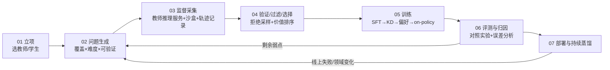

# 00｜总览：蒸馏的关键环节与学习路线

> 系列定位：独立重构的 LLM 蒸馏知识体系（v2）
> 日期：2026-08-01
> 阅读时间：约 5 分钟
> 目标：快速掌握蒸馏技术全貌，并能按 `90-MVP搭建指南.md` 搭建可运行的最小系统

---

## 一、我对"蒸馏关键环节"的独立划分

抛开任何具体文献的章节结构，把蒸馏看成一条**生产线**，它必须回答七个环环相扣的问题。每个问题就是一个关键环节，对应本系列的一篇文档：

| # | 环节 | 回答的问题 | 文档 |
|---|---|---|---|
| 1 | 立项与师生选型 | 为什么蒸馏而不是微调/量化/路由？教师和学生怎么选？ | `01` |
| 2 | 任务与问题生成 | 让学生学什么？问题从哪来、怎么覆盖、怎么控难度？ | `02` |
| 3 | 监督采集与轨迹生产基础设施 | 教师的答案、logits、工具轨迹怎么规模化地生产和记录？沙盒怎么搭？ | `03` |
| 4 | 数据验证、过滤与选择 | 哪些数据配进训练集？怎么验证、去重、按价值挑选？ | `04` |
| 5 | 训练目标与算法 | 用什么损失、在谁的分布上训练？SFT/KD/DPO/on-policy 怎么选？ | `05` |
| 6 | 评测、对比与学生迭代 | 怎么证明学生变强了？怎么归因、怎么决定下一轮补什么？ | `06` |
| 7 | 部署、安全与持续蒸馏 | 怎么上线、怎么防止安全退化、领域变化后怎么继续学？ | `07` |

外加一篇工程文档：

| # | 文档 | 内容 |
|---|---|---|
| 90 | `90-MVP搭建指南.md` | 在多卡服务器上搭建最小闭环的完整方案 + 开源实现分析。**所有 MVP 相关内容都集中在这一篇**，其余文档只讲原理与方法。 |

### 为什么这样划分

多数教程按"算法类型"划分蒸馏（黑盒/白盒、响应级/特征级）。但工程实践中真正的瓶颈几乎从来不是损失函数，而是**数据生产线**：值得学的问题从哪来、教师监督怎么规模化采集且可信、训练完怎么知道该补什么。所以本系列把"算法"压缩为一个环节（05），把"数据生产"展开为三个环节（02/03/04）——这与工业界的实际投入比例一致。

三个最容易被低估的环节，恰好也是你最关心的三个：

- **02 问题生成**——决定学生能力上限的不是教师，而是问题集的覆盖与难度分布；
- **03 轨迹生产基础设施**——推理/Agent 蒸馏的隐性前提：没有沙盒执行环境和轨迹记录系统，就没有可验证的行为数据。这是大多数资料（包括本项目 v1 系列）不写、但实际工作量最大的部分；
- **06 结果对比与学生优化**——蒸馏是迭代过程而非一次训练，"诊断→补题→再训→回归"的闭环质量决定第二轮以后的收益。

## 二、一张图看全流程

注意两条回边：06→02（学生弱点驱动下一轮出题）和 07→02（线上失败驱动补题）。**没有回边的蒸馏是一次性数据工程；有回边才是闭环系统。**

## 三、推荐阅读顺序

1. **想最快跑通系统**：`00 → 90(MVP) → 遇到问题回查对应环节文档`
2. **想系统学习**：按 `01 → 02 → 03 → 04 → 05 → 06 → 07` 顺序，每篇 10–20 分钟；
3. **只关心推理/Agent 蒸馏**：`02 → 03 → 05（on-policy 部分）→ 06`。

每篇文档的结构统一为：核心问题 → 方法与关键决策 → 常见坑 → 进一步学习（带注释的小综述）→ 一页结论。

## 四、贯穿全系列的五条原则

1. **验证器优先于教师**。教师输出只有通过独立验证（执行、规则、证据）才能成为训练数据；能自动验证的任务永远优先做。
2. **在固定预算下对比**。任何"更好的方法"都必须在相同训练 token/成本下战胜分层随机基线，否则先怀疑流程而不是加复杂度。
3. **学生分布重于教师分布**。训练-推理分布不匹配（exposure bias）是蒸馏效果的第一杀手，on-policy 方法的全部动机都在这里。
4. **轨迹必须可重放**。记录不能只有文本，还要有环境版本、工具定义、种子；不能重放的轨迹无法验证，也无法在学生失败时定位原因。
5. **每一轮都做回归**。新能力上升、旧能力下降是常态而非例外；回归集与目标集同等重要。

## 五、与 v1 系列（你现有的六篇文档）的关系

v1 系列质量不错，可作为并行参考。主要差异：

- v1 缺失的**轨迹生产基础设施**（沙盒、执行环境、轨迹 schema、重放）在本系列 `03` 中系统展开；
- v1 各篇散落的 MVP 内容在本系列中全部收拢到 `90`，并给出具体开源组件选型；
- v1 的 01（数据闭环）在本系列拆成 `02`（生成）+ `04`（选择），因为两者的方法体系和工具链不同；
- v1 的 04（师生匹配）+ 05（部署）在本系列压缩为 `01` + `07`，把省出的篇幅给了基础设施与迭代优化。
