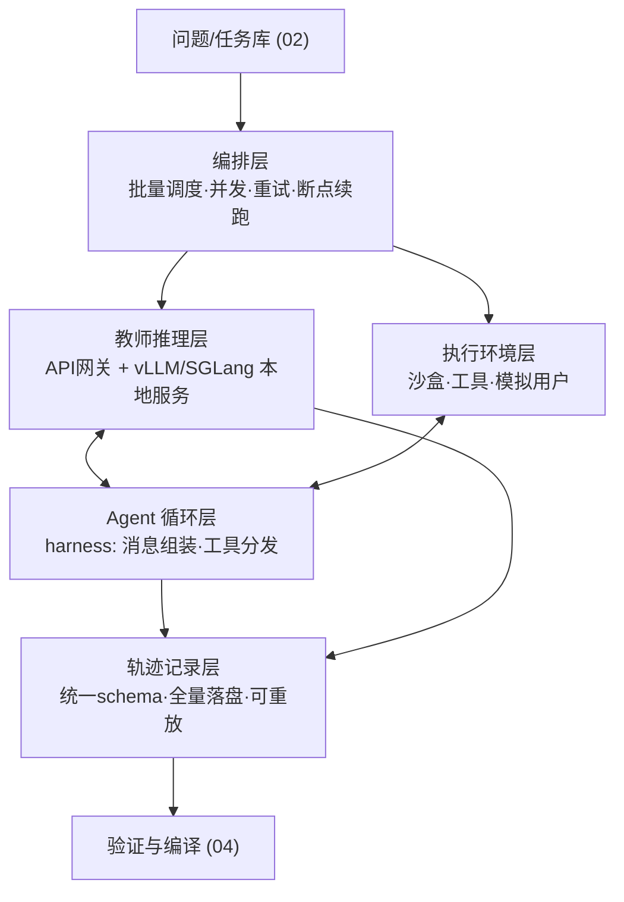

# 03｜监督采集与轨迹生产基础设施

> 系列：[总览](00-总览-蒸馏关键环节与学习路线.md)
> 阅读时间：约 20 分钟
> 回答的问题：教师的答案、logits、工具轨迹如何规模化、可复现地生产？沙盒执行环境怎么搭？这是推理/Agent 蒸馏文献普遍不写、但工程量最大的环节。

---

## 一、基础设施全景

蒸馏的数据生产系统由五个子系统组成：



单轮问答蒸馏只需要 编排+推理+记录；推理蒸馏加上验证器执行（数学检查、代码单测）；**Agent 轨迹蒸馏五层全要**。下面逐层展开。

## 二、教师推理层

### 2.1 两条通道

- **API 教师**：写一个统一网关封装各家 API，必备能力：并发限流、指数退避重试、请求/响应全量落盘（含模型版本、采样参数）、成本计量、多 key 轮换。现成方案可用 LiteLLM 做协议统一。
- **本地开源教师**：用 vLLM 或 SGLang 起服务。大批量生成场景关注三点：
  - **离线批推理**（`llm.generate` / offline batch 模式）吞吐远高于在线 API 模式，纯生成任务用它；
  - **前缀缓存**：同一题多采样、同一 few-shot 前缀的场景可数倍提速，SGLang 的 RadixAttention 在多轮/多采样共享前缀时优势明显；
  - **结构化输出**：工具调用参数用 guided decoding（JSON schema 约束）能显著降低格式废品率。

### 2.2 logits/logprobs 采集（白盒 KD 的前提）

- vLLM/SGLang 均可返回每个位置的 top-k logprobs（k 通常 20 以内）。**top-k + 温度平滑足够做 token-KD**，不需要全词表分布（存储会爆炸：全词表 fp16 logits 约为文本的数千倍体积）；
- 存储格式建议：`(token_id, logprob)` 的 top-k 列表按位置存，zstd 压缩的 parquet；
- 注意：教师返回的 logprobs 必须与**学生模板渲染后的同一 token 序列**对齐才能用于训练，跨模板需要重新前向教师（teacher forced scoring），这是常被忽略的一步——很多团队存了一堆无法对齐的 logprobs。
- on-policy KD 场景（教师给学生的生成打分）必须用本地教师：API 教师做不了任意序列的 teacher-forced 打分（部分 API 只给自己生成 token 的 logprobs）。

### 2.3 采样策略即数据策略

同一道题的教师调用不是一次，而是一组：

```text
每题预算 = k 次多样采样（T≈0.7-1.0，用于拒绝采样和难度实测）
        + 1 次低温采样（T≈0-0.3，作为主答案候选）
        + （可选）1 次带批评提示的自检修正
```

k 的典型取值 4–16。多采样同时服务三个目的：拒绝采样的候选池、`p_T`（教师稳定性）的估计、难度坐标的实测。**这笔钱不能省**，单采样数据集没有质量信号。

## 三、执行环境层（沙盒）

### 3.1 为什么必须有沙盒

推理/Agent 蒸馏的可信度全部建立在"结果可执行验证"上：代码要跑单测、SQL 要查库、工具调用要看环境终态。没有沙盒就只能靠 LLM Judge，等于把地基建在评价偏差上。同时，教师/学生生成的代码和命令**不可信**，必须隔离执行。

### 3.2 沙盒选型

| 方案 | 隔离强度 | 启动开销 | 适合 |
|---|---|---|---|
| 进程级（subprocess + 资源限制） | 弱 | ~0 | 纯数学验证、可信代码片段 |
| Docker 容器池 | 中 | 秒级（预热池可到毫秒级） | 自建集群的默认选择：代码执行、SWE 任务、数据库环境 |
| microVM（Firecracker 系：E2B、Modal Sandbox、Daytona 等托管服务） | 强 | 百毫秒级 | 不想自运维、需要弹性到数千并发、执行完全不可信代码 |
| SWE-ReX 之类的执行运行时 | 封装层 | — | 在上述基座上提供"并行 shell 会话"抽象，SWE-agent 生态标配 |

多卡服务器自建的务实路线：**Docker 容器池 + 每任务独立容器 + 只读镜像层 + 资源限额（CPU/内存/超时/网络默认断网）**。要点：

- 容器**预热池**（提前起 N 个待命容器）把每任务启动开销从秒级降到可忽略；
- 环境**镜像版本化**：镜像 hash 记入轨迹，环境变了旧轨迹就标记为不可重放；
- 网络默认关闭，需要联网的工具走白名单代理并全量记录。

### 3.3 环境抽象：把任务写成 Environment

把每类任务封装成统一接口（Gym 风格），这是整个基础设施最值得投资的抽象：

```python
class Environment:
    def reset(task_spec) -> Observation      # 初始化环境到 task 的初始状态
    def step(action) -> (Observation, done)  # 执行一个工具调用/动作
    def verify() -> RewardInfo               # 终态检查：任务是否完成（可执行判据）
    def snapshot() / restore()               # 状态快照，支持重放与分叉
```

好处：任务生成（`02`）、教师轨迹采集、学生评测（`06`）、on-policy 训练（`05`）四个阶段**复用同一套环境**，杜绝"训练时环境和评测时环境不一致"这类致命 bug。

开源可参照/直接复用的环境体系：

- **verifiers**（Prime Intellect）：把"环境 = MultiTurnEnv/ToolEnv + rubric 打分"标准化，配套 Environments Hub 有社区环境可装；同时能直接对接其 prime-rl / TRL 训练。**当前该抽象做得最干净的库**，即使不用它训练，schema 也值得抄；
- **AgentGym / R2E-Gym**：多环境 Agent 训练套件；
- **tau-bench / tau2-bench**：带**模拟用户**的客服型多轮工具环境——模拟用户本身也是个 LLM 角色，这是多轮 Agent 数据的标准做法；
- **SWE-smith + SWE-ReX**：软件工程任务的"无限任务工厂 + 并行执行运行时"。

### 3.4 模拟用户与多轮任务

多轮 Agent 任务需要一个"用户"参与对话。做法：用另一个 LLM 扮演用户，给它人设、目标和信息释放策略（不能一次把所有信息说完）。关键控制点：模拟用户的 prompt 和模型版本也要版本化记录——它是环境的一部分，它变了任务难度就变了。

## 四、Agent 循环层（harness）

harness 负责把"模型"变成"Agent"：组装消息、解析工具调用、分发到环境、把 observation 塞回上下文、控制预算。要点：

- **教师和学生共用同一 harness**。否则你蒸馏的是"教师+它的脚手架"的行为，学生推理时脚手架不同，分布就错位。工具 schema、系统提示、停止条件全部一致；
- 预算控制：最大步数、最大 token、单工具超时、总超时。教师轨迹也要在这些预算内产生，否则学生学到的是自己执行不了的策略；
- 失败也要完整记录：超时、格式错误、死循环轨迹是 `04` 中构造对比数据和 `06` 中错误分析的原料，不要在 harness 层丢弃；
- 可以直接改造现成 harness：OpenHands、SWE-agent（软件任务），或百行代码自写 tool-loop（通用工具任务，配合 OpenAI 兼容接口的 tool calling）。自写的好处是记录点完全可控，MVP 阶段推荐（见 `90`）。

## 五、轨迹记录层

### 5.1 统一 schema

一条轨迹的最小完整记录：

```jsonc
{
  "trajectory_id": "...",             // 唯一ID
  "task_id": "...",                   // 关联任务spec（含成功判据）
  "actor": {"model": "...", "version": "...", "sampling": {...}},
  "harness_version": "...",
  "env": {"image_hash": "...", "tools_schema_hash": "...", "seed": 42,
           "sim_user": {"model": "...", "prompt_hash": "..."}},
  "messages": [                        // 学生模板可渲染的标准消息流
    {"role": "system", "content": "..."},
    {"role": "user", "content": "..."},
    {"role": "assistant", "content": "...", "tool_calls": [...]},
    {"role": "tool", "tool_call_id": "...", "content": "..."}
  ],
  "steps": [                           // 与 messages 对齐的结构化步骤
    {"idx": 0, "action": "...", "args": {...}, "observation_ref": "...",
     "latency_ms": 800, "error": null}
  ],
  "outcome": {"task_success": true, "verify_detail": {...},
               "final_state_digest": "...", "total_tokens": 8321, "cost_usd": 0.14},
  "timestamps": {...}
}
```

设计原则：

1. **messages 与 steps 双轨**：messages 供训练编译（直接渲染成学生模板），steps 供分析与验证（结构化查询"哪些轨迹在第 3 步用错了工具"）；
2. **一切引用皆哈希**：环境镜像、工具 schema、prompt 都以内容哈希记录，等价于给数据上版本锁；
3. **observation 原文落盘**（大对象存对象存储，轨迹里存引用）——训练时要区分"模型该预测的 token"和"环境给的 token"（observation 不算 loss），没有原文就没法编译。

业界正在收敛的参考格式：**Agent Data Protocol (ADP)**——一个统一各家 Agent SFT 数据集的中间表示，设计你自己 schema 前值得读一遍。

### 5.2 重放（replay）

可重放是轨迹数据的质检标准：`restore(snapshot) + 依次执行 steps → 应得到相同终态`。工程上：

- 入库前对**抽样轨迹**做重放验证（全量重放太贵），重放失败率是基础设施健康度的核心指标；
- 环境升级后，用重放判断旧轨迹是否失效（工具接口变了→整批降权或标废）；
- 对确定性环境记录 seed；对不可完全确定的环境（联网检索），把工具响应缓存进轨迹，重放时用缓存回放（record-replay 模式）。

### 5.3 观测与运营

规模上来后（>10⁴ 轨迹/天）必须有 dashboard：任务成功率按环境/难度分桶、教师格式废品率、沙盒故障率、单条轨迹成本、队列积压。轨迹生产是个"工厂"，要用工厂的方式运营。LangFuse/W&B Weave 等 LLM tracing 工具可以直接复用作为轨迹查看器。

## 六、成本与产能设计

一条 Agent 轨迹的成本 ≈ 教师 token 费（多步累积，20 步轨迹常见 50k–200k token）+ 沙盒机时。粗略预算法：

```text
目标：N 条验证通过的轨迹
需生成 ≈ N / (任务可解率 × 教师成功率 × 验证通过率)   // 三项连乘常低至 0.2-0.4
教师费用 ≈ 生成条数 × 平均轨迹 token × 单价
沙盒机时 ≈ 生成条数 × 平均执行时间 / 并发数
```

降本三板斧：难题才用贵教师（先用便宜模型探难度）；prefix cache 榨干多采样；失败早停（前几步就格式崩坏的轨迹立即掐断）。

## 七、常见坑

1. **教师用 A 脚手架，学生用 B 脚手架**——蒸出来的能力无法迁移，全流程统一 harness。
2. **只存最终文本不存 observation 边界**——训练时无法 mask 环境 token，学生学会"幻觉工具输出"。
3. **环境不版本化**——三个月后没人知道哪些轨迹还有效。
4. **沙盒不断网**——教师生成的代码 `pip install` 了新版本依赖，重放全挂；更糟的是安全事故。
5. **同步阻塞式编排**——教师 API 延迟高，不做 asyncio 并发 + 断点续跑，产能差一个数量级。
6. **先上 K8s 再跑通逻辑**——MVP 阶段单机 Docker 池 + 一个 asyncio 脚本足够（见 `90`），分布式是产能问题不是功能问题。

## 八、进一步学习（小综述）

**环境与执行基础设施**：
- [verifiers](https://github.com/PrimeIntellect-ai/verifiers) + [Environments Hub 介绍](https://www.primeintellect.ai/blog/environments)——环境抽象的当前最佳实践；配套 [prime-rl](https://github.com/PrimeIntellect-ai/prime-rl) 可扩到大规模训练。
- [SWE-ReX](https://github.com/SWE-agent/SWE-ReX)——大规模并行沙盒 shell 执行运行时（SWE-agent 团队）。
- [SWE-smith](https://openreview.net/forum?id=63iVrXc8cC)——任务工厂 + 轨迹生产的完整开源实现，其 5 万条轨迹和训练出的 SWE-agent-LM 全部公开。
- 托管沙盒对比：[Modal 的 2026 沙盒横评](https://modal.com/resources/best-code-execution-sandboxes-tool-calling-ai-agents)（注意是厂商视角）。

**轨迹数据格式与数据集**：
- [Agent Data Protocol](https://arxiv.org/html/2510.24702v1)——统一 Agent SFT 数据的中间表示，schema 设计必读。
- [APIGen-MT](https://arxiv.org/html/2504.03601v4)——多轮"模拟人-Agent 互演"数据管线的代表实现。
- [TOUCAN](https://arxiv.org/html/2510.01179)——从真实 MCP 环境批量产轨迹的开源方案。
- [tau-bench](https://github.com/sierra-research/tau-bench)——模拟用户型环境的参考实现。

**推理服务**：
- [vLLM](https://github.com/vllm-project/vllm) / [SGLang](https://github.com/sgl-project/sglang) 文档中 offline batch inference、prefix caching、structured output 三节——数据生产吞吐的决定因素。

**Agent harness 参考**：
- [SWE-agent](https://github.com/SWE-agent/SWE-agent)、[OpenHands](https://github.com/All-Hands-AI/OpenHands)——工具循环、上下文管理、预算控制的成熟实现，适合读源码抄设计。

## 九、一页结论

```text
五层架构：编排 → 教师推理 → 沙盒环境 → Agent循环 → 轨迹记录
教师学生共用同一 harness、同一环境抽象（Environment.reset/step/verify）
每题多采样是质量信号的来源，不是浪费
轨迹 schema：messages(训练用) + steps(分析用) + 全量哈希版本化
可重放 = 数据质检标准；observation 必须可 mask
单机 Docker 池起步，产能瓶颈出现后再分布式
```
